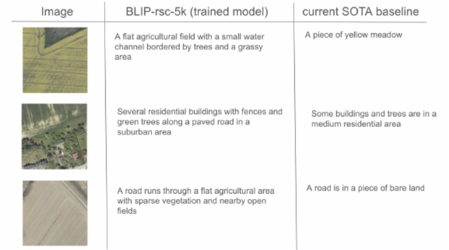

# Novel Synthetic Labelling System for Scalable Remote Sensing Captioning

A Fall 2024 [Data Discovery](https://cdss.berkeley.edu/discovery) project in partnership with **IBM**, advised by **Ranjan Sinha** and **Karina Kervin**.

**Poster:** [Environmental Intelligence Using Machine Learning](https://cdss.berkeley.edu/project/environmental-intelligence-using-machine-learning)

---

## Overview

Annotating remote sensing imagery at scale is expensive and time-consuming. This project introduces a synthetic labelling pipeline that eliminates manual annotation by aligning remote sensing image tiles with street-level imagery and using a vision-language model to generate high-quality captions automatically. The generated dataset is then used to fine-tune a pretrained vision-language model (in this case, Salesforce's BLIP model pretrained on RSICD dataset) for more detailed land cover analysis.

The flow proposed in this project reduces end-to-end dataset creation time from weeks to < 8 hours, suggesting potential in building more scalable training systems for geospatial captioning.

---

## Pipeline


```
LandCover.AI TIFs
       │
       ▼
1. lcai_pipeline.py   — split orthophotos into 512×512 patches, geocode each patch,
                        fetch the nearest Google Street View image
       │
       ▼
2. blip_inference.py  — run BLIP on remote sensing patches to produce initial captions
       │
       ▼
3. s3_upload.py       — upload patches + street view images to S3
       │
       ▼
4. join_tables.py     — merge coordinate table with BLIP captions
       │
       ▼
5. text_augmentation.py — filter by street view distance, augment captions with
                          GPT-4o-mini using the paired street view image
       │
       ▼
6. finetune_blip.py   — fine-tune BLIP on the synthetic dataset
       │
       ▼
7. test_inference.py  — side-by-side qualitative comparison of base vs. fine-tuned captions
                          (RemoteCLIP cosine similarity included as a reference signal only)
```

---

## Configuration

All paths, API keys, model names, and hyperparameters live in **`src/config.py`**. Secrets are read from environment variables — never hardcoded. Copy `.env.example` to `.env` and fill in your values.

| Variable | Description |
|---|---|
| `DATA_DIR` | Root directory for all local data files |
| `GOOGLE_MAPS_API_KEY` | Google Maps Static / Street View API key |
| `OPENAI_API_KEY` | OpenAI API key (GPT-4o-mini) |
| `HF_TOKEN` | Hugging Face token for pushing models |
| `S3_BUCKET` | AWS S3 bucket name |
| `AWS_ACCESS_KEY_ID` / `AWS_SECRET_ACCESS_KEY` / `AWS_DEFAULT_REGION` | Standard AWS credential env vars |

---

## Example Results

The fine-tuned model (BLIP-rsc-5k) produces noticeably more detailed and spatially grounded captions compared to the SOTA baseline.



---

## Setup

```bash
pip install gdal pillow pyproj requests pandas matplotlib \
            transformers torch torchvision datasets \
            openai boto3 open_clip_torch huggingface_hub tqdm

# For RemoteCLIP evaluation
git clone https://github.com/ChenDelong1999/RemoteCLIP/

# Download LandCover.AI dataset
kaggle datasets download -d adrianboguszewski/landcoverai
unzip landcoverai.zip -d data/lcai_tifs
```

Copy `.env.example` to `.env`, fill in your credentials, then source it and run each script in order:

```bash
cp .env.example .env
# edit .env with your values
source .env

python src/lcai_pipeline.py
python src/blip_inference.py
python src/s3_upload.py
python src/join_tables.py
python src/text_augmentation.py
python src/finetune_blip.py
python src/test_inference.py
```
